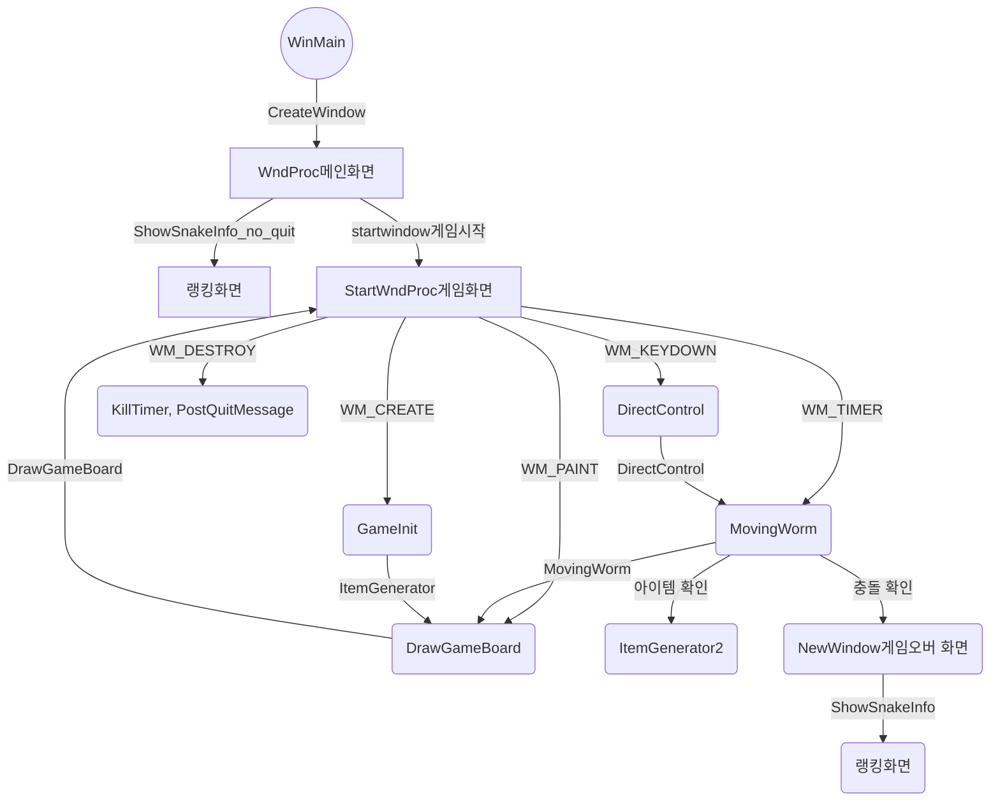

# 뱀 게임

이 프로젝트는 WinAPI를 사용하여 만든 뱀 게임입니다.

## 게임 설명

뱀 게임은 전통적인 아케이드 게임으로, 뱀을 조작하여 먹이를 먹고 자신의 몸통을 늘려가는 게임입니다. 

### 기능

- **뱀 조작**: 방향키를 사용하여 뱀을 이동시킵니다.
- **먹이 먹기**: 먹이를 먹으면 뱀의 길이가 늘어납니다.
- **벽 또는 자기 자신에 부딪히면 게임 종료**: 벽이나 뱀의 몸통에 부딪히면 게임이 종료됩니다.
- **점수 기록**: 먹은 먹이의 수로 점수를 기록합니다.

## 실행 방법

1. 해당 프로젝트를 클론합니다.
2. Visual Studio 이용해 프로젝트를 엽니다.
3. 솔루션을 빌드합니다.
4. 게임을 실행합니다.

## 게임 화면

 **시작(메안) 화면**
 

**게임 화면**

**게임오버 화면**

**랭킹 화면**

## 관계도

## 사용된 기술

- **WinAPI**: Windows용 응용 프로그램을 개발하기 위한 API를 사용했습니다.

## 저자

이 게임은 [sunbaklee]에 의해 만들어졌습니다.

## 최신버전

2023-11-28 버전

